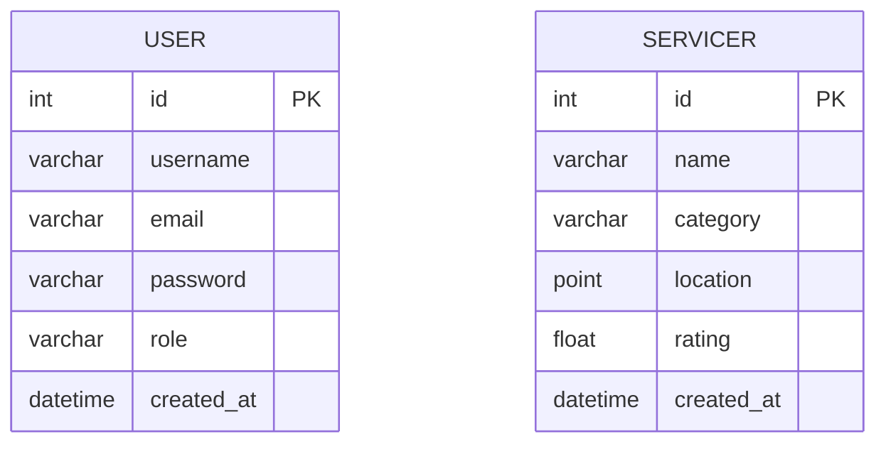

# 📍 Local Service Finder

Local Service Finder is a full-stack application for discovering, managing, and exploring local services using a spatially-enabled backend and a modern React/Next.js frontend.

---

## 📌 Project Summary

This repository contains a Django REST API backend (with GeoDjango/PostGIS support) and a Next.js frontend. The project provides:

- Public search and listing of local services (nearby search using geospatial queries).
- Admin dashboard and API for creating, updating, and deleting service records.
- JWT cookie authentication for admin actions.
- A map-based user interface using React Leaflet.

This README has been expanded to explain the primary data model, architecture, API surface, and setup steps so a new contributor or user can get started quickly.

---

## 🌐 Architecture (high level)

- `lsa_backend/` — Django project configuration, global settings, and URL routing.
- `ls_backend/` — Django app containing models, views, serializers, permissions, and API endpoints.
- `lsa/` — Next.js frontend app (App Router) containing pages, API proxy routes, and React components.
- `docker-compose.yml` — local development services (PostGIS, Redis) used by the backend.

---

**Data Model (ER diagram)**

Below is a concise ER diagram (Mermaid) representing the primary models found in `ls_backend/models.py`. It captures the core entities a reader will encounter.



---

## 🔎 Data Model Details

- **User**: lightweight custom user model defined in `ls_backend/models.py`. Fields: `username`, `email (unique)`, `password` (hashed on save), `role` (admin or public), and `created_at`.
- **Servicer**: represents a local service or place. Fields: `name`, `category` (choices such as Hospital/ATM/Shop/Other), `location` (GeoDjango `PointField`), `rating`, and `created_at`.

Notes:

- The project currently uses a simple custom `User` model rather than Django's built-in `AbstractUser` extension. Passwords are hashed when saving if not already hashed.
- `Servicer.location` is a geospatial field (requires PostGIS and GeoDjango) and is indexed for efficient spatial queries.

---

## 📌 API Reference (quick)

Public endpoints (used by the frontend public pages):

- `GET /api/public/` — list services (supports pagination).
- `GET /api/public/<id>/` — retrieve a single service by ID.
- `GET /api/public/<limit>/<skip>/` — paginated listing.
- `GET /api/public/search/nearby` — geospatial nearby search (accepts point and radius parameters).

Admin endpoints (require authenticated admin user):

- `POST /api/login/` — authenticate and set JWT cookie tokens.
- `POST /api/service/create` — create a new `Servicer`.
- `PUT/PATCH /api/service/update/<pk>` — update an existing `Servicer`.
- `DELETE /api/service/delete/<pk>` — delete a `Servicer`.

For complete API details, see the view modules in [ls_backend](ls_backend).

---

## 🛠️ Setup & Development

1. Start local services (PostGIS, Redis):

```bash
cd /home/vscode/Local_Service_Finder
docker-compose up -d
```

2. Backend (Python/Django):

```bash
cd /home/vscode/Local_Service_Finder
python -m venv myvenv
source myvenv/bin/activate
pip install -r requirements.txt
python manage.py migrate
python manage.py runserver
```

3. Frontend (Next.js):

```bash
cd /home/vscode/Local_Service_Finder/lsa
npm install
npm run dev
```

4. Open the app

- Frontend: http://localhost:3000
- Backend API: http://localhost:8000

---

## 🧭 Contributing notes

- If you add new fields to `Servicer` or `User`, add corresponding serializer changes in `ls_backend/serriialiiizers.py` and update any frontend form handling in `lsa/app`.
- Keep geospatial queries efficient by adding indexes when appropriate and using GeoDjango query helpers.

---

## ⚠️ Important Notes

- The frontend proxy configuration is defined in `lsa/next.config.ts` and directs `/api-backend/*` to the Django backend in development.
- Admin-only backend actions require users with `role='admin'`.
- The backend requires PostGIS for spatial fields; the Docker Compose configuration provides a PostGIS service for local development.

---

## 📄 License

MIT License
